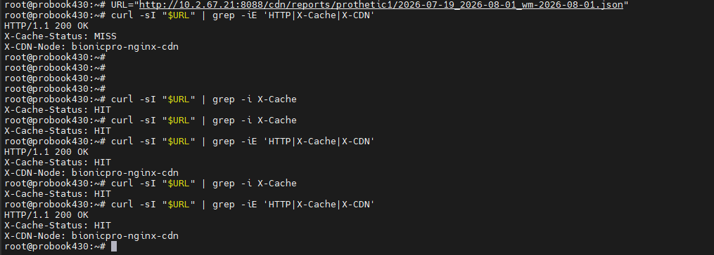

# S3 + CDN cache-aside (Задание 3)

## Как показать CDN на защите

CDN = Nginx reverse proxy к MinIO с `proxy_cache`. Доказательство — заголовок **`X-Cache-Status`**.

```bash
# 1) Получи cdn_url из API (после Login → Download Report) или собери ключ:
#    reports/<username>/<from>_<to>_wm-<watermark>.json
URL="http://10.2.67.21:8088/cdn/reports/prothetic1/2026-07-19_2026-08-01_wm-2026-08-01.json"

# 2) Первый запрос — промах кеша (Nginx сходил в MinIO)
curl -sI "$URL" | grep -iE 'HTTP|X-Cache|X-CDN'
# X-Cache-Status: MISS
# X-CDN-Node: bionicpro-nginx-cdn

# 3) Второй запрос — попадание в кеш Nginx (MinIO / ClickHouse не трогаем)
curl -sI "$URL" | grep -iE 'HTTP|X-Cache|X-CDN'
# X-Cache-Status: HIT
```

Скрин двух ответов (MISS → HIT) — достаточное доказательство CDN.

| Файл | Описание |
|------|----------|
| [screenshots/05-cdn-cache-hit.png](screenshots/05-cdn-cache-hit.png) | Скрин терминала: MISS → HIT |
| [screenshots/05-cdn-cache-hit.txt](screenshots/05-cdn-cache-hit.txt) | Тот же вывод текстом |



## Архитектура

```
UI → reports-api /reports
        │
        ├─ S3 HIT  → { cache: HIT,  cdn_url }
        └─ S3 MISS → ClickHouse mart → put S3 → { cache: MISS, cdn_url }
                              │
                              ▼
              browser/curl → Nginx CDN :8088/cdn/... → (cache) → MinIO
```

## S3 ключи (инвалидация)

```
reports/{username}/{date_from}_{date_to}_wm-{etl_watermark}.json
```

Когда Airflow обновляет watermark, ключ меняется → новый объект → CDN `MISS` (старый кеш просто устаревает по `inactive=24h` / `proxy_cache_valid 1h`).

## Порты

| Сервис | URL |
|--------|-----|
| CDN (Nginx) | http://HOST:8088 |
| MinIO API | http://HOST:9002 |
| MinIO Console | http://HOST:9001 (minioadmin / minioadmin) |
| reports-api | http://HOST:8000 |

## Конфиг

- [`nginx/cdn.conf`](../nginx/cdn.conf) — proxy_cache + `X-Cache-Status`
- [`minio/create-bucket.sh`](../minio/create-bucket.sh) — bucket `bionicpro-reports`, public GET
