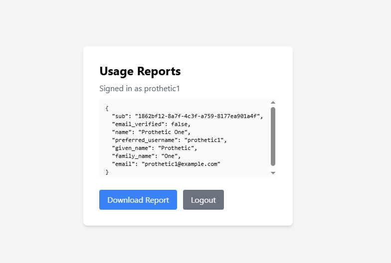

# Сервис отчётов (Задание 2)

## Архитектура

| Файл | Описание |
|------|----------|
| [reports-c4.drawio](reports-c4.drawio) | C4 Container (draw.io) |
| [reports-c4.png](reports-c4.png) | PNG |

Поток: **CRM DB + Telemetry DB → Airflow ETL → ClickHouse mart → reports-api `/reports` → UI**.

## Компоненты

- `source-db` — PostgreSQL с схемами `crm` и `telemetry` (seed-данные)
- `clickhouse` — OLAP: staging + `user_report_mart` + `etl_watermark`
- `airflow` — DAG `bionicpro_reports_etl` (ежечасно)
- `reports-api` — FastAPI `GET /reports`, ACL self-only через `bionicpro-auth`

## Запуск

```bash
docker compose up -d --build source-db clickhouse airflow-init airflow reports-api
# дождаться первого DAG run (или Trigger в UI Airflow)
```

- Airflow UI: http://HOST:8085 (admin / admin)
- reports-api: http://HOST:8000/health
- Frontend: Download Report → `GET /reports`

## Витрина `bionicpro.user_report_mart`

Агрегаты телеметрии по пользователю и дню + поля CRM. API читает только её (без runtime join).

Если запрошенный `date_to` больше `etl_watermark` → **404** (период ещё не обработан Airflow).

## Скриншот (E2E)

Авторизованный UI отчётов под `prothetic1` (сессия + кнопка Download Report):



## Задание 3 (S3/CDN)

После первого `GET /reports` объект кладётся в MinIO, ответ содержит `cdn_url`.  
Повторный запрос — `cache: HIT` без обращения к ClickHouse.  
Как показать CDN-кеш Nginx: [cdn.md](cdn.md).
