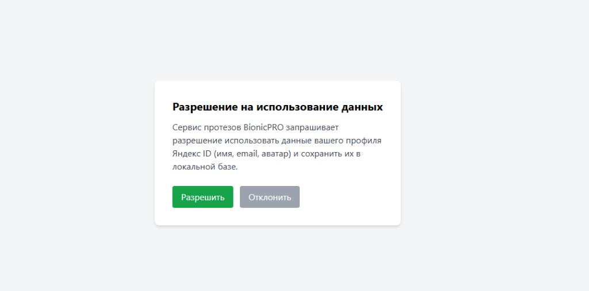
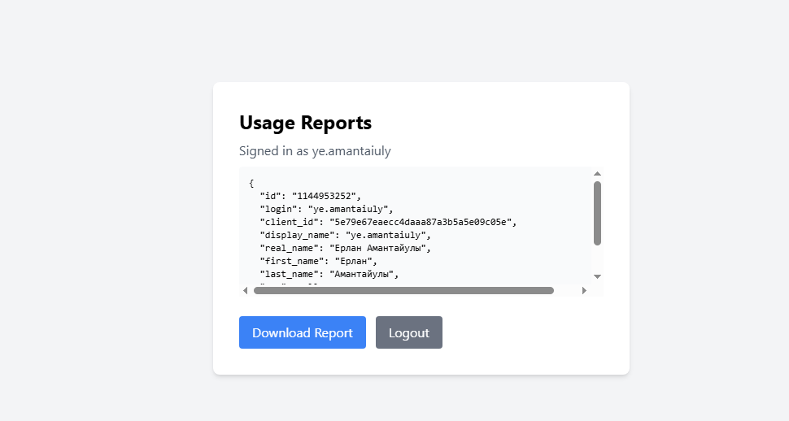

# Яндекс ID / Identity Brokering (Задание 1 / Задача 6)

## Redirect URI в кабинете Яндекса (точно так)

```
http://10.2.67.21:8080/realms/reports-realm/broker/yandex/endpoint
```

(локально также можно оставить `http://localhost:8080/...` — лучше добавить оба URI в кабинете Яндекса)

## Важно: Keycloak и Yandex OAuth

Яндекс — это OAuth2, не полный OIDC. Keycloak OIDC-брокер:
1. всегда добавляет scope `openid` → прокси `/auth/yandex-authorize` убирает его;
2. требует `id_token` → прокси `/auth/yandex-token` обменивает code у Яндекса и синтезирует `id_token`;
3. шлёт `Bearer` в userinfo, Яндекс ждёт `OAuth` → прокси `/auth/yandex-userinfo`;
4. Keycloak 21 требует claim `nonce` в `id_token` (опция `disableNonce` здесь не работает) —
   authorize-прокси запоминает nonce, token-прокси кладёт его в синтетический JWT.

В IdP URL-ы указывают на `http://10.2.67.21:8001/auth/yandex-*`.

## Секреты

```bash
cp secrets/yandex.env.example secrets/yandex.env
# заполнить Client ID / Secret
```

`secrets/yandex.env` в `.gitignore`.

## Настройка Keycloak

```bash
chmod +x keycloak/configure-yandex-idp.sh
./keycloak/configure-yandex-idp.sh
```

Создаёт OIDC IdP `yandex` (oauth.yandex.ru) + mappers + store tokens.

## Consent + профиль в БД

После логина через Яндекс `bionicpro-auth`:

1. Спрашивает разрешение использовать данные профиля
2. При «Разрешить» тянет профиль с `login.yandex.ru/info` (через broker token)
3. Сохраняет в SQLite `/data/profiles.db`

Эндпоинты: `POST /auth/consent/accept`, `POST /auth/consent/deny`, `GET /auth/profile`

## Проверка

1. Rebuild: `docker compose up -d --build bionicpro-auth frontend`
2. http://10.2.67.21:3000 → **Login with Yandex ID**
3. Авторизация на Яндексе → (при первом входе MFA) → экран согласия → профиль в UI

## Скриншоты (подтверждение E2E)

| Файл | Что закрывает |
|------|----------------|
| [screenshots/02-yandex-consent.png](screenshots/02-yandex-consent.png) | Запрос разрешения на использование данных профиля |
| [screenshots/03-yandex-profile-ui.png](screenshots/03-yandex-profile-ui.png) | Профиль Яндекс ID в UI после сохранения в БД |




